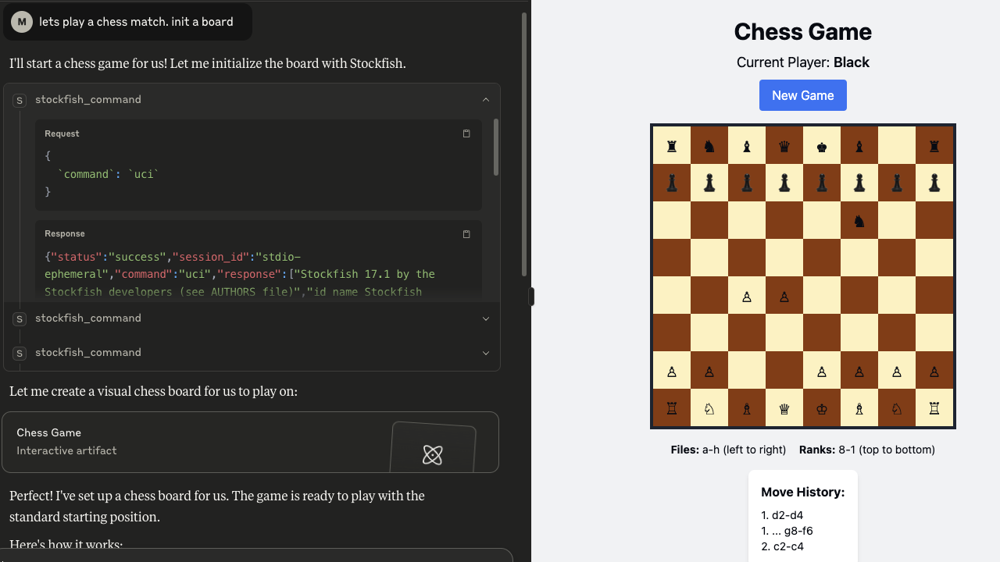

# mcp-stockfish 🐟

A Model Context Protocol server that lets your AI talk to Stockfish. Because apparently we needed to make chess engines even more accessible to our silicon overlords.



> 🧠⚡🖥️ *Your LLM thinks, Stockfish calculates, you pretend you understand the resulting 15-move tactical sequence.*

## What is this?

This creates a bridge between AI systems and the Stockfish chess engine via the MCP protocol. It handles multiple concurrent sessions because your AI probably wants to analyze seventeen positions simultaneously while you're still figuring out why your knight is hanging.

Built on [mark3labs/mcp-go](https://github.com/mark3labs/mcp-go). Because reinventing wheels is for people with too much time.

## Features

- **🔄 Concurrent Sessions**: Run multiple Stockfish instances without your CPU crying
- **⚡ Full UCI Support**: All the commands you need, none of the ones you don't
- **🎯 Actually Works**: Unlike your last side project, this one has proper error handling
- **📊 JSON Everything**: Because apparently we can't just use plain text anymore
- **🐳 Docker Ready**: Containerized for when you inevitably break your local setup

## Supported UCI Commands ♟️

| **Command**          | **Description**                                                                |
| -------------------- | ------------------------------------------------------------------------------ |
| `uci`                | Initializes the engine in UCI mode                                            |
| `isready`            | Checks if the engine is ready. Returns `readyok`                              |
| `position startpos`  | Sets up the board to the starting position                                    |
| `position fen [FEN]` | Sets up a position using FEN notation                                         |
| `go`                 | Starts the engine to compute the best move                                    |
| `go depth [n]`       | Searches `n` plies deep. Example: `go depth 10`                                |
| `go movetime [ms]`   | Thinks for a fixed amount of time in milliseconds. Example: `go movetime 1000` |
| `stop`               | Stops current search                                                          |
| `quit`               | Closes the session                                                            |

## Quick Start

### Installation

```bash
git clone https://github.com/sonirico/mcp-stockfish
cd mcp-stockfish
make install
```

### Usage

```bash
# Default mode (stdio, because we're old school)
mcp-stockfish

# With custom Stockfish path (for the special snowflakes)
MCP_STOCKFISH_PATH=/your/special/stockfish mcp-stockfish

# HTTP mode (for the web-scale crowd)
MCP_STOCKFISH_SERVER_MODE=http mcp-stockfish
```

## Configuration ⚙️

### Environment Variables

#### Server Configuration

- `MCP_STOCKFISH_SERVER_MODE`: "stdio" or "http" (default: "stdio")
- `MCP_STOCKFISH_HTTP_HOST`: HTTP host (default: "localhost") 
- `MCP_STOCKFISH_HTTP_PORT`: HTTP port (default: 8080)

#### Stockfish 🐟 Configuration

- `MCP_STOCKFISH_PATH`: Path to Stockfish binary (default: "stockfish")
- `MCP_STOCKFISH_MAX_SESSIONS`: Max concurrent sessions (default: 10)
- `MCP_STOCKFISH_SESSION_TIMEOUT`: Session timeout (default: "30m")
- `MCP_STOCKFISH_COMMAND_TIMEOUT`: Command timeout (default: "30s")

#### Logging

- `MCP_STOCKFISH_LOG_LEVEL`: debug, info, warn, error, fatal
- `MCP_STOCKFISH_LOG_FORMAT`: json, console  
- `MCP_STOCKFISH_LOG_OUTPUT`: stdout, stderr

## Tool Parameters

- `command`: UCI command to execute
- `session_id`: Session ID (optional, we'll make one up if you don't)

## Response Format

```json
{
  "status": "success|error", 
  "session_id": "some-uuid",
  "command": "what you asked for",
  "response": ["what stockfish said"],
  "error": "what went wrong (if anything)"
}
```

## Session Management

Sessions do what you'd expect:

- Spawn Stockfish processes on demand
- Keep UCI state between commands  
- Clean up when you're done (or when they timeout)
- Enforce limits so you don't fork-bomb yourself

## Integration

### Claude Desktop

```json
{
  "mcpServers": {
    "chess": {
      "command": "mcp-stockfish",
      "env": {
        "MCP_STOCKFISH_LOG_LEVEL": "info"
      }
    }
  }
}
```

## Development

```bash
make deps     # Get dependencies
make build    # Build the thing
make test     # Run tests (when they exist)
make fmt      # Make it pretty
```

## Credits 🐟

Powered by [Stockfish](https://stockfishchess.org/), the chess engine that's stronger than both of us combined. Created by people who actually understand chess, unlike this wrapper.

Thanks to:

- The [Stockfish team](https://github.com/official-stockfish/Stockfish) for making chess engines that don't suck
- [MCP SDK for Go](https://github.com/mark3labs/mcp-go) for handling the protocol so I don't have to
- Coffee

## License

MIT - Do whatever you want, just don't blame me when it breaks.
